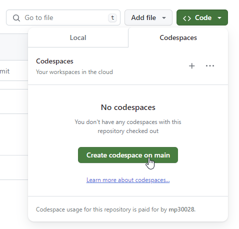
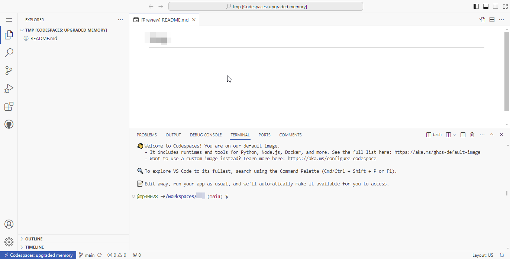
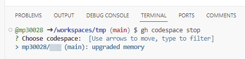
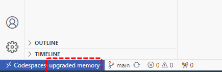
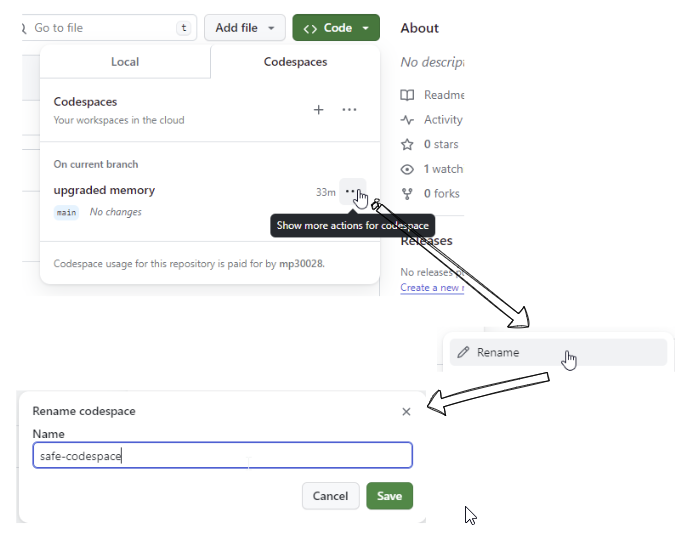
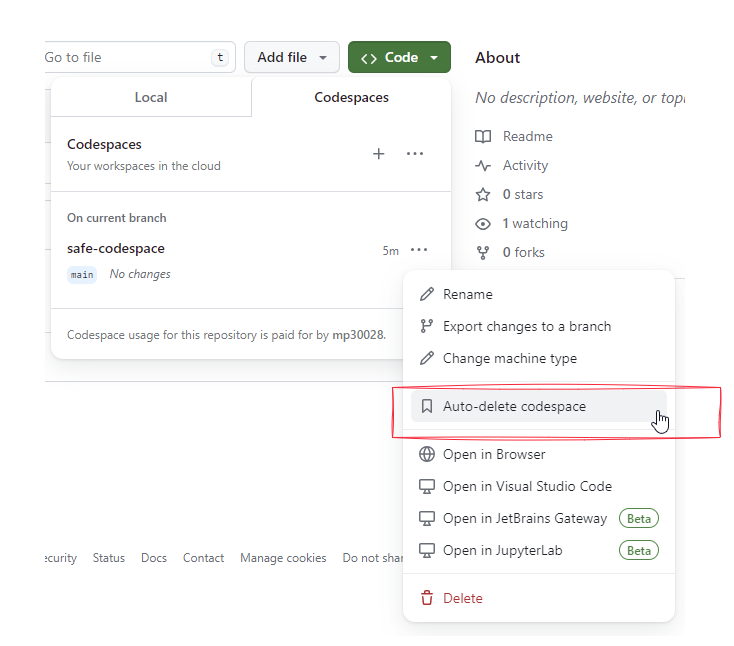
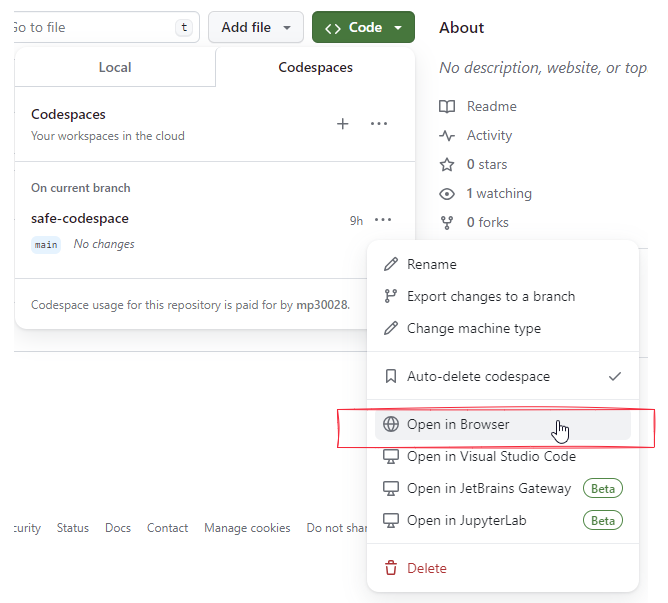

## Initial Setup - Creating the GitHub codespaces container
This utility uses the kpcli software to manage secrets stored in an encrypted keepass database.<br/>

The idea is to store the encrptyed keepass database on GitHub and to open it using the kpcli software installed in a GitHub codespaces container.<br/>

Therefore there are some initial one time steps involved to create the GitHub codespaces container with kpcli installed.

### 1 From the repository home page navigate to the `Create codespace on main` button <br/>


### 2 Wait till the process completes. 
You should eventually see something


### 3 Shutdown the codespace session
On the terminal prompt run `gh codespace stop` <br/>
You may see a list of one or more codespaces. Select the relevant one using the arrow keys <br/>

 <br/>)

In case you are not sure of the name,  at the bottom left of the ide you will see the name assigned to the codespace <br/>

 <br/>

Once the codespace is stopped you should see a screen similar to this <br/>
 <br/>

Close this tab and return to the repository home page <br/>

### 4 Rename the codespace
 <br/>

### 5 Disable auto-delete
 <br/>

### 6 Restart the codespace <br/>
 <br/>

### 7 Install kpcli

```
sudo apt update
sudo apt install kpcli libterm-readline-gnu-perl libdata-password-perl
```
<br/>

