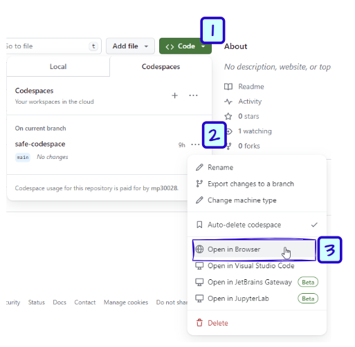
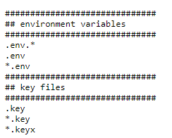
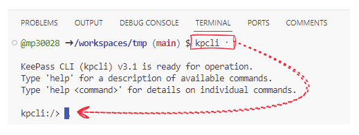
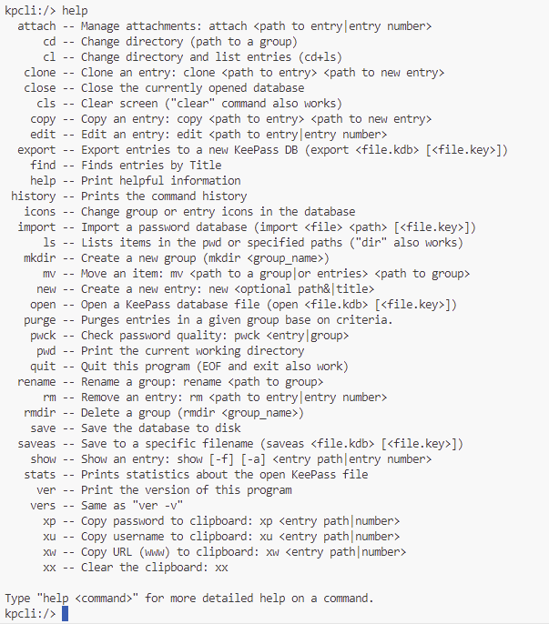
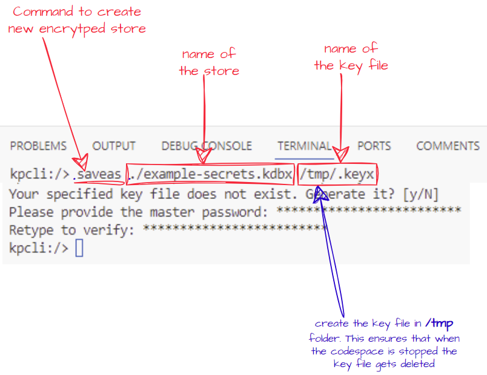
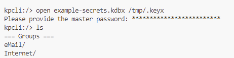

## Creating a secure encrypted data store
The utility stores the secrets in a keepass data store which can either be created from scratch or added to the repository. 
The data store will be protected with an encryption key and a password. 
The encryption key is generated when the data store is created and has to be stored somewhere where it can be retrieved and used to open the data store. 
In this instance we will be storing the generated encryption key in the repository's codespace secret.

### 1. Start the codespace

### 2. Add a .gitignore file to ignore keys
Ensure the following entries are present in an existing or a new `.gitignore` file. If not create the file and add these in  

### 3. Start a kpcli interactive session
Once the codespace has been started you should see the terminal with a command prompt. 
On the command prompt run `kpcli`  
This should start an interactive kpcli session  

  

### 4. List available functions within the session
type `help` on the session prompt to see a full list of commands available 
  

### 5. Create a new encrypted store with key file
run `saveas ./example-secrets.kdbx /tmp/.keyx` to create an encrypted store called `example-secrets.kdbx` with a key file called `.keyx` 

### 6. Save the generated key in codespace secret

### 7. Open an existing KeePass encrypted db
`open example-secrets.kdbx /tmp/.keyx`  

### 8. Create a new KeePass encrypted db
`saveas tryout.kdbx /tmp/.keyx`

 

### 9. Save the contents of the keyfile into a codespace secret for future reference and use
`cat /tmp/.keyx`  
Then select and copy the output and put into the codespace secret called KP_KEY  

### 10. Next time you want to use the saved keys in codespace secret
`echo ${KP_KEY} > /tmp/.keyx && truncate -s -1 /tmp/.keyx`  
NB: the truncate is usually needed to remove the newline character that gets added when the codespace secret is created  

### 11. Now open the keepass db using the /tmp/.keyx created above

### 12. Start a kpcli session
`kpcli`

### 13. Open the encrypted db using the key file
`open example-secrets.kdbx /tmp/.keyx`  

### 14. To find how to update the stored secrets etc use the help within the session
`help`  

### 15. When done close the session 
type `exit` within the kpcli session  

### 16. Finally stop and exit the codespace
`gh codespace stop`  
**Note:** this is important for two reasons 
a) Use of codespace beyond a certain threshold is chargeable. Shutting down stops unnecessary charges 
b) On exit the /tmp folder is cleaned up. This is important as the key file is created there if the above commands are followed 
