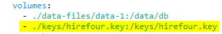
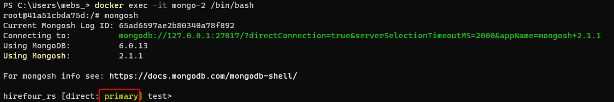
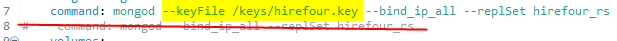

## Setting up Authentication

### Useful Resources
[mongodb manuals](https://www.mongodb.com/docs/manual/tutorial/configure-scram-client-authentication/)


### Authentication Cookbook

To enable authentication on a replica set [see this](https://www.mongodb.com/docs/manual/tutorial/enforce-keyfile-access-control-in-existing-replica-set/)

Basic steps are

1. Generate the keys using open-ssl
`openssl rand -base64 -out example.key 756`

2. Update the docker-compose.yml to ensure the keys are available to the container
   

3. Startup the cluster as per usual<br/>
   from the folder where this document resides `cd ../../docker/example-api/db`<br/>
   `docker compose up -d`

4. Change the ownership and permissions on the key file from within the container<br/>
   
   4.1 Shell into the container running the primary node `docker exec -it mongo-2 /bin/bash`
       
   
   4.2 `chown mongodb:root /keys/example.key`
   
5. Create the admin user by executing the following 
```
use admin
db.createUser(
  {
    user: "example_admin",
    pwd: passwordPrompt(), // or cleartext password
    roles: [
      { role: "userAdminAnyDatabase", db: "admin" },
      { role: "readWriteAnyDatabase", db: "admin" },
	   { role: "dbAdminAnyDatabase"  , db: "admin" },
	   { role: "clusterAdmin"        , db: "admin" }      
    ]
  }
)
```

6. Shutdown the cluster
   6.1 exit the container
   6.2 `docker compose down`
   
7. update the start up command in the docker compose script to use the key file
   

8. start up the cluster
   (See 3.above)

9. login with the new admin user account
   9.1  Shell into the container (see 4.1 above)
   9.2  Log into the db with mongosh `mongosh --authenticationDatabase "admin" -u "example_admin" -p "*************"`

10. Grant additional roles to the user created earlier

```
use admin
db.grantRolesToUser(
    "example_admin",
    [
      { role: "userAdminAnyDatabase", db: "admin" },
      { role: "readWriteAnyDatabase", db: "admin" },
	   { role: "dbAdminAnyDatabase"  , db: "admin" },
	   { role: "clusterAdmin"        , db: "admin" }
    ]
)
```


