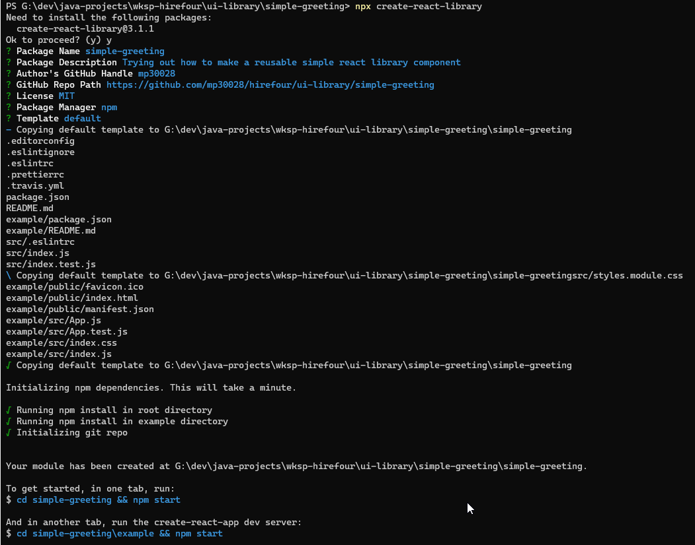

## Instructions

1. Install the tool (If already installed then should not be necessary)
`npm i create-react-library`

2.
`npx create-react-library simple-greeting`

## Resources
[Following instructions here](https://soshace.com/how-to-careate-a-react-ccomponent-library-using-a-modal-example/}

./src/App.js
Module not found: Can't resolve '....' Error from chokidar (G:\): Error: EBUSY: resource busy or locked, lstat 'G:\pagefile.sys'
